This is a page of Jesoas.

# Budget Tracking App

This is a simple budgeting dashboard/journal built with **React** and **Recharts**. 
The project helps users track their spending over time, categorize their expenses, and visualize the data using pie and line charts.

## Table of Contents
- [Features](#features)
- [Data Format](#data-format)
- [Components](#components)
- [Dashboard.jsx](#dashboardjsx)
- [Journal.jsx](#journaljsx)
- [Styling](#styling)
- [Group members](#group-members)
- [Screenshots](#screenshots)

## Features

- Two Pages: Dashboard and Journal.
- Fully responsive chart container using **Recharts**.
#### Dashboard

- Toggle between **Yearly**, **Monthly**, and **Category** views.
- View category breakdown as a pie chart.
- View historical spending as a line chart.
#### Journal

- Add journal entries with categories and values *without file updates*.
- Dynamic form for adding new spending categories.

## Data Format

The app uses a mock dataset located in src/data/spendingData.js. Each entry looks like this:

    {
      id: 1,
      date: "2024-06-12",
      amount: 150,
      category: "Groceries",
      note: "Weekly food shopping"
    }

## Components

### Dashboard.jsx

The main visual representation page. It includes:

* Radio buttons for toggling view modes.
* Dropdowns for selecting year/month/category.
* PieChart (Category Breakdown) using Recharts.
* LineChart (Time Series) with X-axis formatting.
* Responsive layout using flexbox.

Custom logic:

* Disables month selection in Yearly mode.
* Disables year selection in Custom mode.
* Formats x-axis to prevent overlapping or clipping on narrow screens.

### Journal.jsx

Used for adding and viewing individual spending entries.

* Allows adding new categories dynamically. *(Doesn't save between pages or in case of refresh)*
* Inputs include category, amount and date.
* Category suggestions appear in a dropdown.
* Entries are displayed in a list.

## Styling

* Basic layout styling using inline styles and flexbox.
* Recharts provides responsive chart containers.
* Fonts and colors are kept simple. *White theme never >:)*

# Group members
Aleksandr Romanov

# Screenshots

## Dashboard

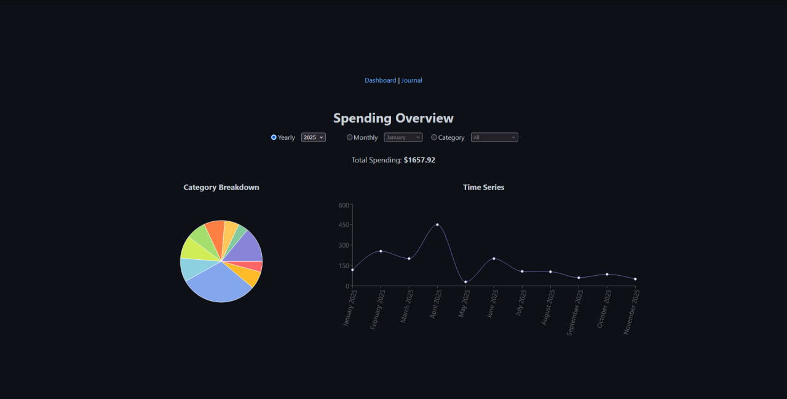
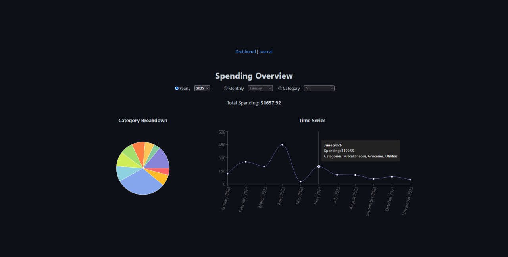
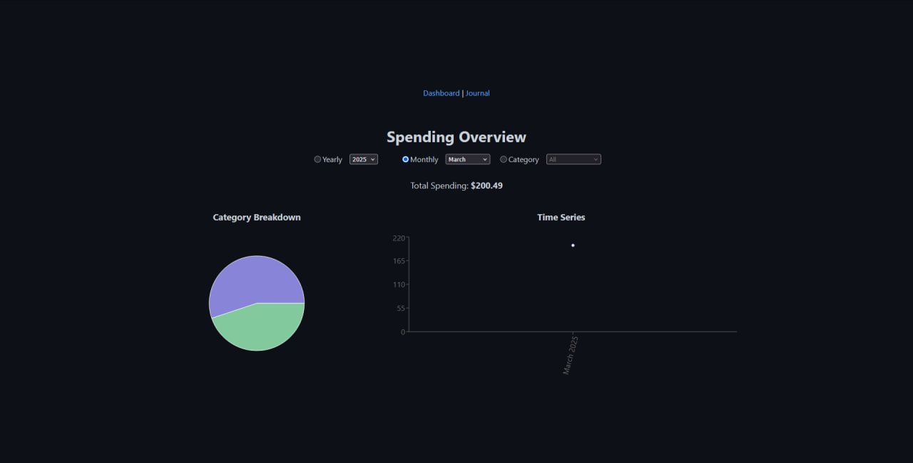
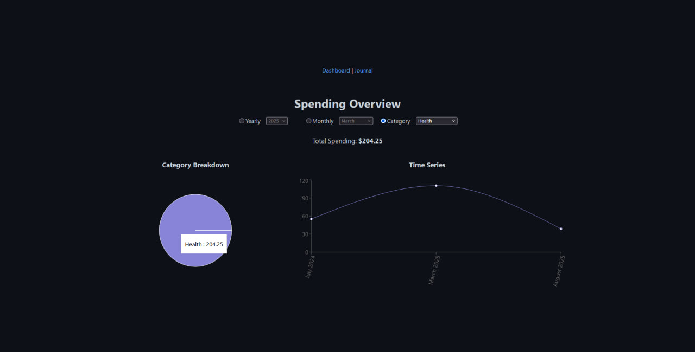

## Journal

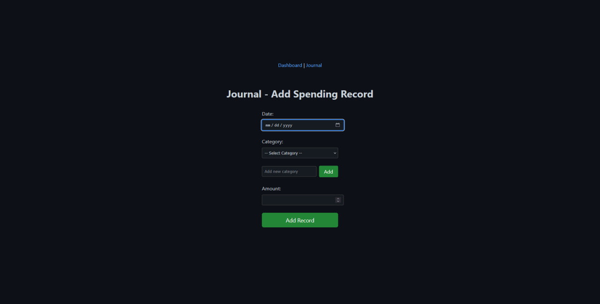
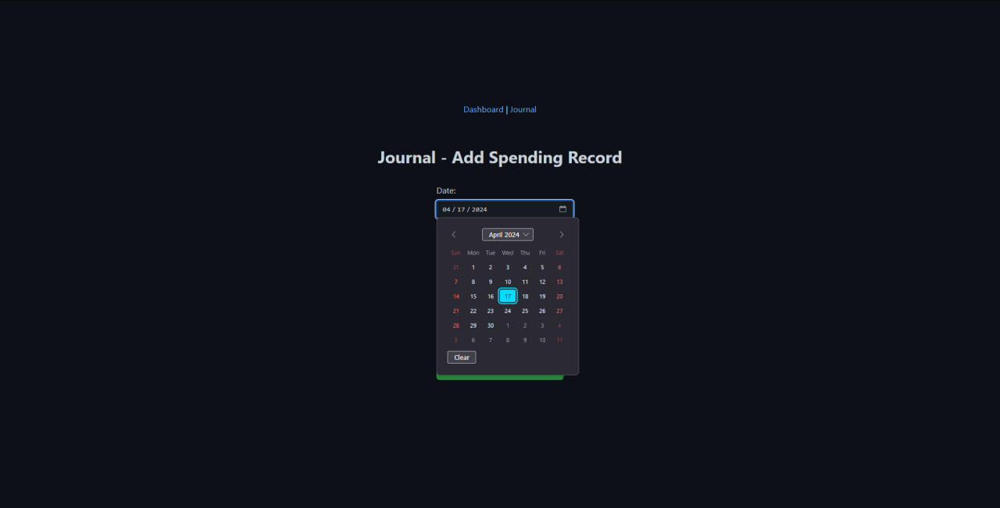
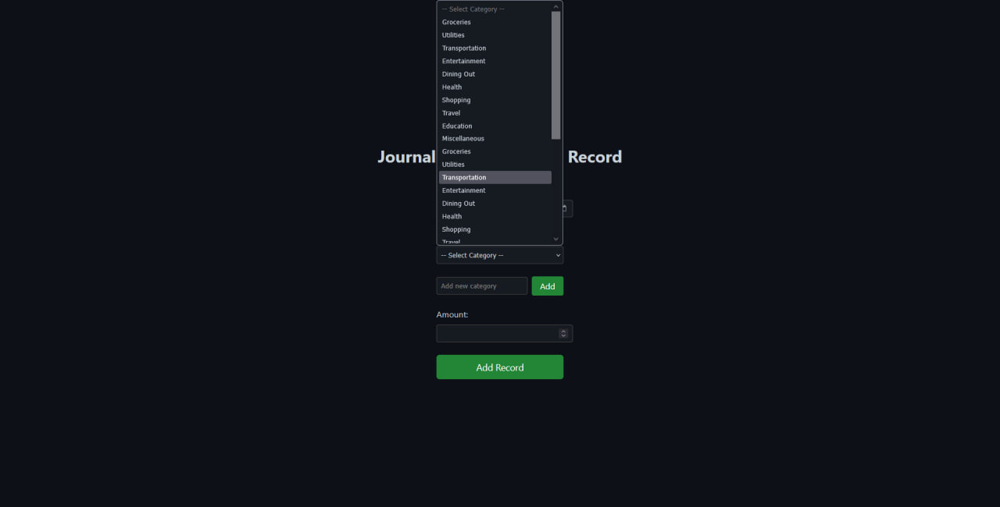
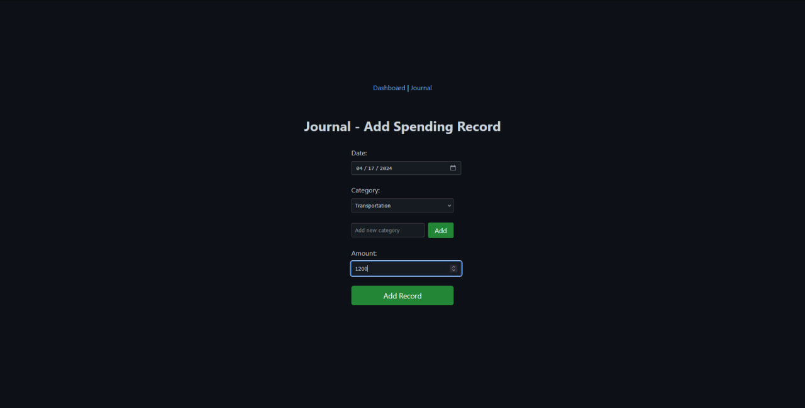
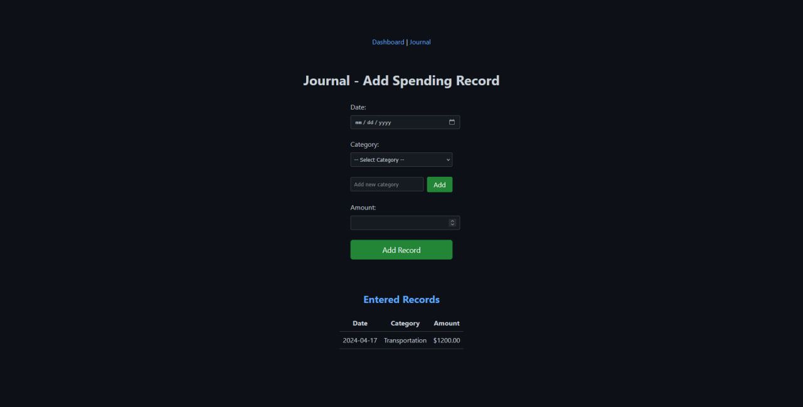
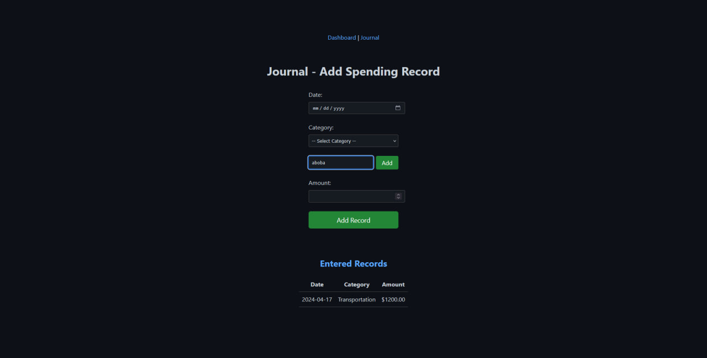
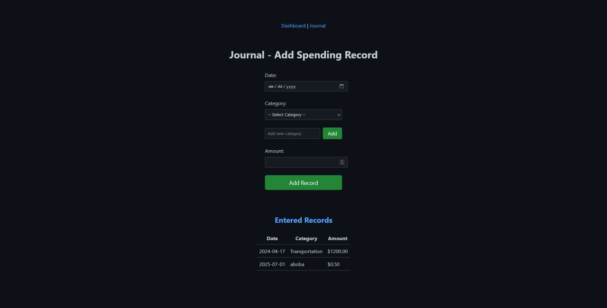
